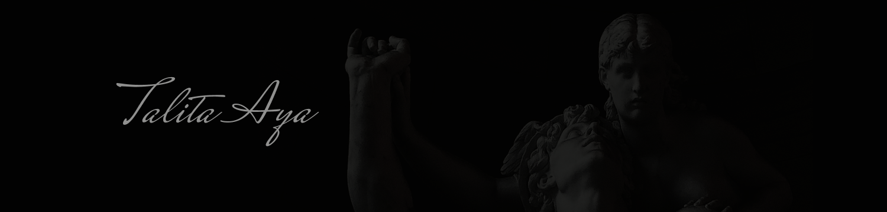

# Portfolio 

 

Esta é uma landing page responsiva totalmente desenvolvida utilizando HTML, CSS e JavaScript. Tal projeto possui o objetivo de apresentar meus principais trabalhos como também algumas informações a meu respeito.

 

## ﹁ Design ﹂
As inspirações para o desenvolvimento do design se encontram nesta pasta do  [Pinterest](https://br.pinterest.com/talita_aya/portfolio/second-version/), em que é possível observar que busquei manter a estética do primeiro portfólio que criei, formado por elementos simples e neutros, de modo a destacar os trabalhos que seriam expostos. Entretanto, nesta nova versão alterei detalhes que me incomodavam e busquei tornar tudo mais compacto e objetivo, além de adicionar funcionalidades para melhorar a usabilidade dos que acessarem, como a possibilidade de navegar entre dois idiomas.

Assim, o design final se encontra no seguinte  [link](https://www.figma.com/file/9qAo8GKWwA2uBTkuiTdfFp/portf%C3%B3lio-2?node-id=1%3A2)

> Nenhuma das imagens utilizadas são autorais, foram todas retiradas do  [Unsplash](https://unsplash.com/). Para os ícones, foi utilizada o plugin  [Iconify](https://www.figma.com/community/plugin/735098390272716381/Iconify)  do Figma.

 

## ﹁ Desenvolvimento ﹂

Foram criadas 4 seções diferentes para melhor organização:

1.  **Banner:**  banner principal do portfólio
2.  **Sobre mim:**  breves informações a meu respeito
3.  **Portfólio:**  onde estão e serão armazenados os projetos escolhidos
4.  **Contato:**  plataformas para que consigam me contatar
